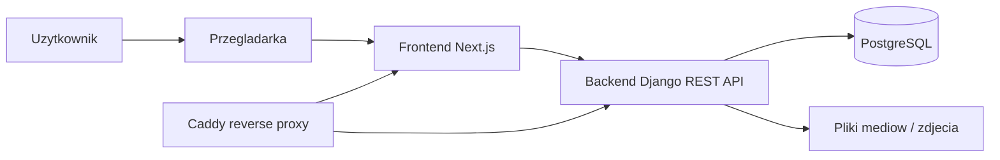
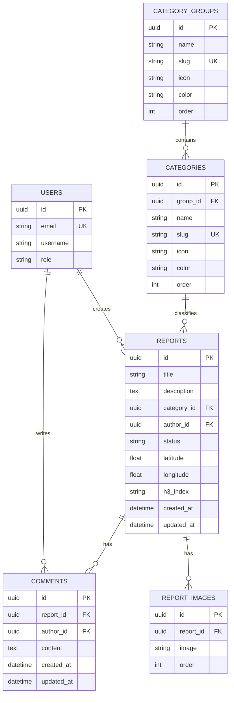
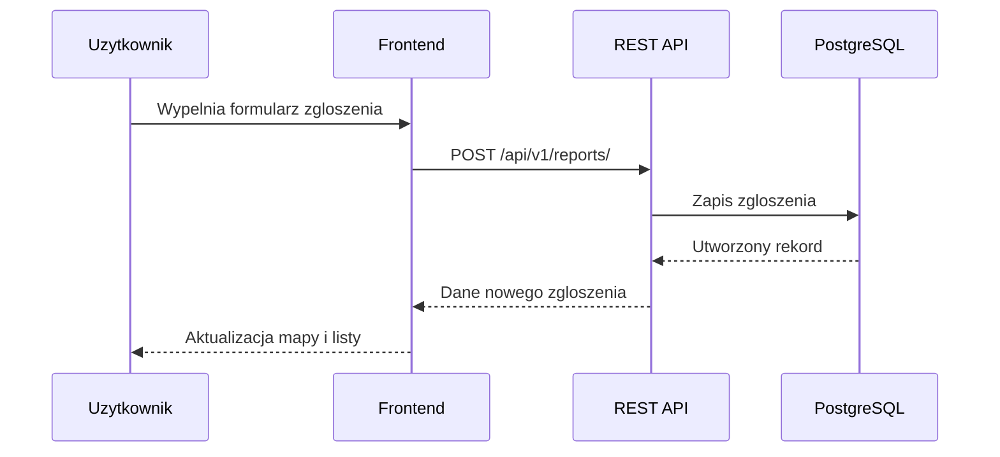

# MapCident

MapCident to system do zglaszania problemow w przestrzeni miejskiej. Aplikacja
pozwala uzytkownikom dodawac zgloszenia z opisem, kategoria, lokalizacja i
zdjeciami, a nastepnie przegladac je na liscie oraz na mapie.

Demo: https://mapcident.qwizi.ovh/

## Cel Projektu

Projekt zostal przygotowany w ramach przedmiotu dotyczacego architektury,
komunikacji miedzy systemami oraz baz danych. System sklada sie z trzech
glownych elementow:

- backendu z REST API,
- bazy danych PostgreSQL,
- aplikacji webowej korzystajacej z API.

## Technologie

- Backend: Django, Django Ninja, Django Ninja JWT
- Frontend: Next.js, React, TypeScript
- Baza danych: PostgreSQL
- Mapa: MapLibre GL
- Konteneryzacja i wdrozenie: Docker, Docker Compose, Caddy
- CI/CD: GitHub Actions, GitHub Container Registry

## Architektura



Frontend komunikuje sie z backendem przez REST API. Backend odpowiada za
uwierzytelnianie, walidacje danych, logike aplikacji oraz zapis i odczyt danych
z PostgreSQL. Zdjecia zgloszen sa zapisywane jako pliki mediow i powiazane z
rekordami w bazie danych.

## Model Danych



Glowna encja systemu to zgloszenie. Zgloszenie jest przypisane do autora,
kategorii, lokalizacji oraz statusu. Dodatkowo moze miec wiele zdjec i
komentarzy. Kategorie sa pogrupowane, co ulatwia filtrowanie i prezentacje
danych w interfejsie.

## Komunikacja



## Funkcjonalnosci

- rejestracja i logowanie uzytkownikow,
- uwierzytelnianie JWT,
- dodawanie, edycja i usuwanie zgloszen,
- dodawanie zdjec do zgloszen,
- lista zgloszen z wyszukiwaniem, filtrowaniem i sortowaniem,
- filtrowanie po kategorii oraz statusie,
- komentarze do zgloszen,
- statusy zgloszen: oczekujace, w trakcie, rozwiazane, odrzucone,
- mapa z pinami i klastrowaniem zgloszen,
- podglad szczegolow zgloszenia po kliknieciu na mapie,
- profil uzytkownika z lista jego zgloszen,
- panel administracyjny Django.

## REST API

Glowne zasoby API:

- `/api/v1/auth/register` - rejestracja uzytkownika,
- `/api/v1/token/pair` - logowanie i pobranie tokenow JWT,
- `/api/v1/auth/me` - dane aktualnego uzytkownika,
- `/api/v1/categories/` - lista kategorii,
- `/api/v1/categories/grouped/` - kategorie pogrupowane,
- `/api/v1/reports/` - lista i tworzenie zgloszen,
- `/api/v1/reports/{id}` - szczegoly, edycja i usuwanie zgloszenia,
- `/api/v1/reports/{id}/images` - dodawanie zdjec,
- `/api/v1/reports/{id}/comments/` - komentarze do zgloszenia,
- `/api/v1/reports/map` - dane zgloszen do wyswietlenia na mapie.

API wykorzystuje standardowe metody HTTP: `GET`, `POST`, `PATCH`, `PUT` i
`DELETE`.

## Uruchomienie Lokalne

1. Skopiuj plik konfiguracyjny:

```bash
copy .env.example .env
```

2. Uruchom kontenery:

```bash
docker compose up --build
```

3. Wykonaj migracje bazy danych:

```bash
docker compose exec backend uv run python manage.py migrate
```

4. Zaladuj startowe kategorie:

```bash
docker compose exec backend uv run python manage.py loaddata apps/categories/fixtures/categories.json
```

Po uruchomieniu:

- frontend: http://localhost:3009
- backend API: http://localhost:8000/api/v1/
- panel admina: http://localhost:8000/admin/

## Wdrozenie

Aplikacja jest dostepna pod adresem:

https://mapcident.qwizi.ovh/

Projekt ma przygotowana konfiguracje produkcyjna w `compose.prod.yml`.
Wdrozenie wykorzystuje kontenery Docker oraz Caddy jako reverse proxy, ktore
kieruje ruch do frontendu Next.js i backendu Django. Baza PostgreSQL dziala jako
osobny kontener.

## Struktura Projektu

```text
apps/          aplikacje Django: users, categories, reports, comments
config/        konfiguracja Django i rejestracja API
frontend/      aplikacja Next.js
caddy/         konfiguracja reverse proxy
compose.yml    lokalne srodowisko developerskie
compose.prod.yml konfiguracja produkcyjna
```
